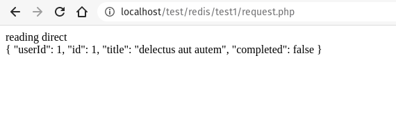
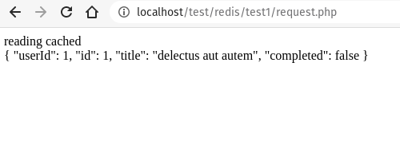
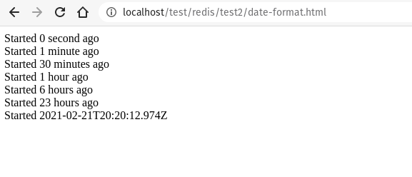
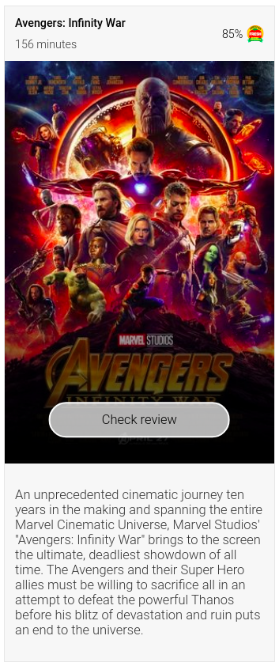
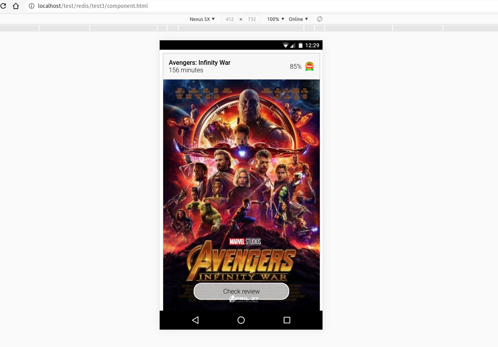

# JBER Projects Application Test

welcome to the JBER Projects Application Test
It is composed of 3 exercise to probe PHP, redis, javascript, HTML and CSS

## snapshots

### Test 1 (REDIS, PHP)

Reading direct



Reading cached



### Test 2 (Javascript)

Javascript test



### Test 3 (HTML, CSS)

Desktop view



Mobile view



## Additional notes
To get the first test running, you need to install and configure redis server

In Ubuntu or Debian you can install with the next commands:

``` 
sudo add-apt-repository ppa:chris-lea/redis-server
sudo apt-get update
sudo apt-get install redis-server
```

You can test your redis server installation with:

``` 
redis-cli ping
```

Redis installation source:
[https://www.digitalocean.com/community/tutorials/how-to-set-up-a-redis-server-as-a-session-handler-for-php-on-ubuntu-14-04](https://www.digitalocean.com/community/tutorials/how-to-set-up-a-redis-server-as-a-session-handler-for-php-on-ubuntu-14-04)